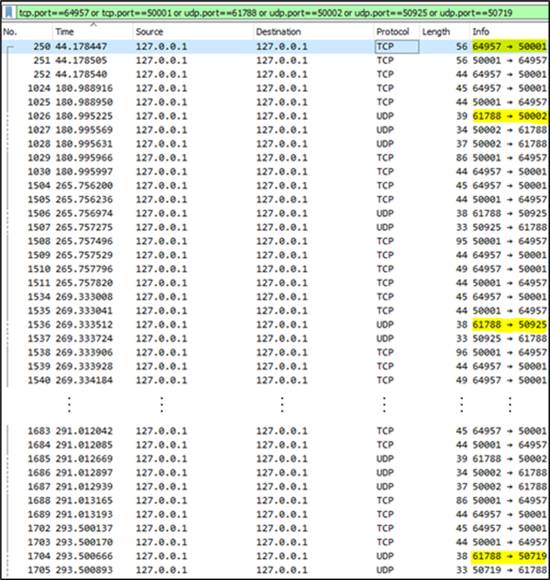

# Nombre del Proyecto
LAB 1

# Descripción
Implementación y captura del tráfico de red del juego Cachipún (Piedra, papel o tijeras) contra la computadora a través de sockets UDP y TCP utilizando una estructura cliente-servidor en Python y Go

Análisis del tráfico:

1. Cantidad de mensajes: Según el esquema, ¿Cuántos mensajes se deberían enviar durante una partida? Considere ahora su código, ¿Cuántos mensajes se enviaron en una partida?

Basándose en el esquema señalado en el enunciado, deberían enviarse al menos 20 mensajes, ya que el Cliente debe solicitar el inicio de la partida (1), el Servidor Intermediario envía la solicitud al Servidor Cachipún (1), éste responde al Intermediario (1), el mensaje es reenviado de vuelta al Cliente (1) y, en el mejor de los casos, la partida se resolverá en 3 turnos, lo que conlleva enviar la jugada (1x3), solicitar la de la computadora (1x3), que éste responda (1x3) y mostrar los resultados en el Cliente (1x3). Finalmente, si el Cliente decide terminar el juego, debe enviar el mensaje de finalización al Servidor Intermediario (1), éste enviarlo al Servidor Cachipún (1), y antes de cerrar la conexión, el Servidor Cachipún envía una confirmación de finalización (1), siendo reenviada al Cliente (1).

En la práctica, se enviaron en total 138 mensajes durante la ejecución del programa, ya que algunos mensajes fueron enviados por separado (en los turnos, al entregar disponibilidad del servidor y nuevo puerto de juego, y al mandar la señal de cierre de servidor), el protocolo TCP involucra mensajes de acuse de recibo de paquetes, de procesos como el 3-way handshaking y se jugaron 2 partidas, de 4 y 10 rondas, respectivamente.  

Ilustración 1 – Tráfico rastreado por Wireshark durante la ejecución del programa Cachipún. Observamos los puertos 64957 y 50001, correspondientes a la conexión TCP entre Cliente y Servidor Intermediario; 61788 y 50002, correspondientes a la mensajería UDP entre Servidor Intermediario y Servidor Cachipún; 61788 y 50925, correspondientes a los puertos usados durante la primera partida entre el Servidor Intermediario y el Servidor Cachipún y 61788 y 50719, usados durante la segunda partida

Ilustración 2 – Recorte del tráfico rastreado por Wireshark antes de iniciar las rondas de juego. Notamos que los mensajes simultáneos 2 y 3, correspondientes a la disponibilidad de partida y el nuevo puerto generado, respectivamente, se envían de forma separada, aumentando la cantidad total de mensajes capturados.

2. Tipos de protocolo utilizados: Referente a los mensajes realizados por las aplicaciones, ¿Qué tipos de protocolo espera ver? ¿Cuáles encontró? 

Debido a que el programa fue diseñado bajo librerías que requerían explícitamente el protocolo a usar, se esperan ver los protocolos TCP para la interacción Cliente-Servidor Intermediario y UDP para Servidor Intermediario-Servidor Cachipún.

En efecto, el reporte, filtrado para mostrar sólo los puertos utilizados durante la ejecución del programa, señala el uso de los protocolos TCP y UDP para las situaciones señaladas.

Ilustración 3 – Recorte del tráfico rastreado por Wireshark durante la ejecución del programa Cachipún. Podemos observar el uso de los protocolos TCP y UDP.

3. Puertos utilizados en conexión TCP: Las interacciones vía TCP entre el Cliente y el Servidor Intermediario, ¿Deben ocupar los mismos puertos a lo largo del tiempo? ¿Coincide con lo visto en Wireshark? 

Debido a que la conexión es local, los puertos usados para la interacción Cliente-Servidor Intermediario son diferentes entre sí. En caso de haber sido una conexión entre procesos de dos hosts diferentes, los puertos pueden ser los mismos (ya que es la IP la que varía). Por otro lado, los puertos asignados deben mantenerse a lo largo del tiempo (mientras no se haga un cambio de puerto explícitamente, en cuyo caso se crean nuevos sockets para la conexión), ya que de esta forma se produce el handshaking (conexión uno a uno) y permite el transporte de los datos de manera fiable.

Observando la captura de Wireshark, podemos notar que los puertos son diferentes entre sí pero estos se conservan durante toda la ejecución del programa.

Ilustración 4 – Recorte del tráfico rastreado por Wireshark durante la ejecución del programa Cachipún. Notamos que tanto la IP fuente como la IP de destino poseen la misma dirección (conexión local) y que los puertos difieren entre sí, pero permanecen constantes a lo largo del tiempo.

4. Puertos utilizados en conexión UDP: Las interacciones vía UDP entre el Servidor Intermediario y el Servidor Cachipún, ¿Deben ocupar los mismos puertos a lo largo del tiempo?, ¿Qué cambia al ejecutar varias partidas seguidas sin cerrar el terminal? ¿Coincide con lo visto en Wireshark?

Similarmente, los puertos son diferentes en las interacciones UDP debido a que la conexión es local, pero pueden ser los mismos en casos donde la conexión sea entre dos hosts diferentes. Sin embargo, a lo largo del tiempo los puertos pueden cambiar, ya que, contrario al protocolo TCP, el protocolo UDP establece una conexión uno a muchos (sin el proceso de handshaking), haciendo que el servidor cree nuevos sockets conforme recibe mensajes en nuevos puertos. En particular, el programa cambia de puertos en cada partida que el Cliente juega con el Servidor Cachipún.

Ilustración 5 – Recorte del tráfico rastreado por Wireshark durante la ejecución del programa Cachipún. Notamos que tanto la IP fuente como la IP de destino poseen la misma dirección (conexión local) y que los puertos, además de diferir entre sí, cambian durante la ejecución, siendo 61788 y 50002 en un inicio (antes de empezar la partida) luego 61788 y 50925 (durante la primera partida), 61788 y 50719 (durante la segunda partida) y nuevamente 61788 y 50002 al momento de apagar el servidor.

5. Legibilidad de los mensajes transmitidos: Respecto al contenido de los mensajes enviados entre cada par de entidades, ¿Son legibles? ¿Por qué?

Los mensajes enviados no son legibles, debido a que, durante el proceso entre la capa de aplicación y la capa de transporte, se codifican. Luego, al ser recibidos por el destinatario, se vuelven a decodificar. Sin embargo, Wireshark dispone de una herramienta que permite decodificar los mensajes capturados.

Ilustración 6 – Recorte de uno de los mensajes capturados por Wireshark durante la ejecución del programa Cachipún. Observamos que se encuentra codificado. 

Ilustración 7 – Flujo TCP decodificado. Podemos observar que los mensajes en rojo son los que manda el Cliente al Servidor Intermedio, mientras que los mensajes en azul son las respuestas que recibe luego de procesar las jugadas.

Ilustración 8 – Flujo UDP decodificado. Notamos que los mensajes en rojo son los que envía el Servidor Intermedio al Servidor Cachipun al comenzar las partidas, mientras que los mensajes en azul representan la disponibilidad del Servidor Cachipun para jugar y los respectivos puertos de juego.

# Herramientas utilizadas
Se ha comprobado el correcto funcionamiento del proyecto con las siguientes versiones:

- Go 1.22.2
- Python 3.12.0
- Wireshark 4.2.3

# Instalación
1. Descargar e instalar Go
2. Descargar e instalar Python
3. (Opcional) Descargar e instalar Wireshark

# Uso
1. Ejecutar el programa cachipun.go con el comando `go run cachipun.go`
2. Ejecutar el programa intermedio.py con el comando `py intermedio.py`
3. Ejecutar el programa cliente.py con el comando `py cliente.py`
4. Jugar
5. (Opcional) Utilizando la herramienta Wireshark, capturar el tráfico de red durante la partida