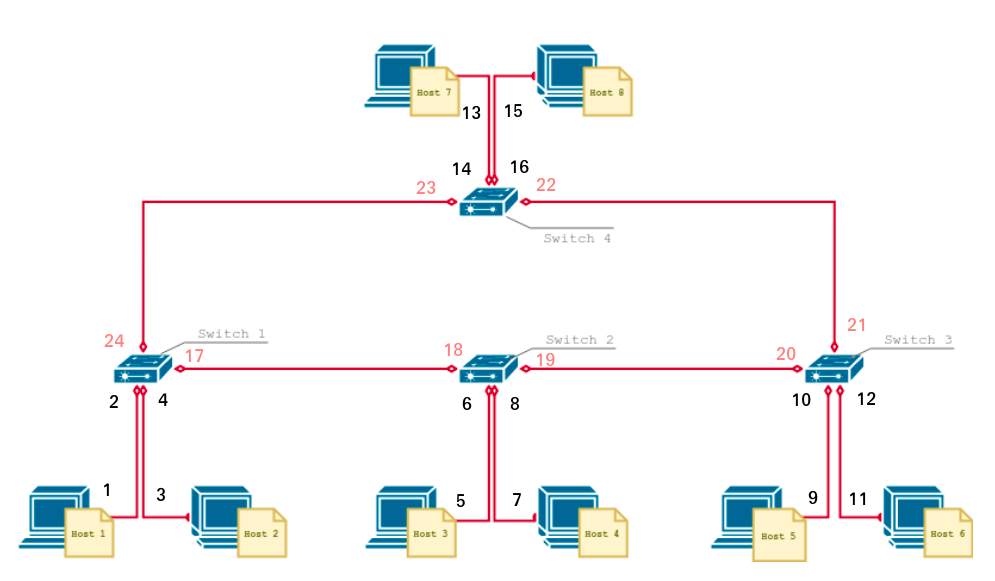
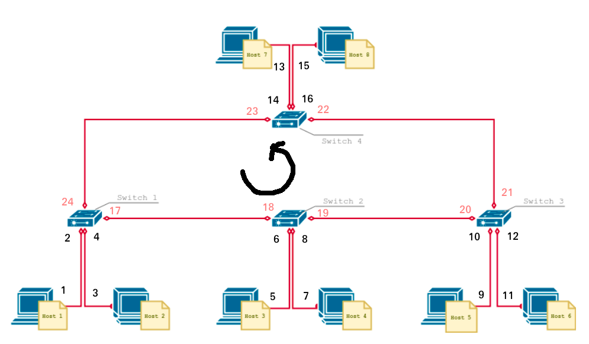
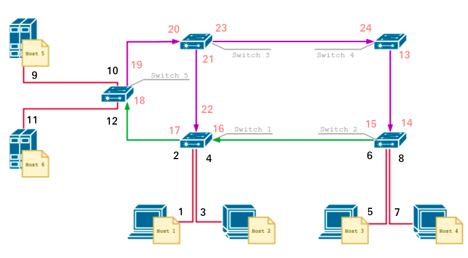

# Nombre del Proyecto
LAB 3

# Descripción
Configuración de dos redes con una topología de tipo anillo simple y otra topología de dos caminos en Python

Etiquetas:

Hosts:
- 1 : h1
- 2 : h2
- 3 : h3
- 4 : h4
- 5 : h5
- 6 : h6
- 7 : h7
- 8 : h8

Switches:
- 1 : s1
- 2 : s2
- 3 : s3
- 4 : s4
- 5 : s5

# Herramientas utilizadas
Se ha comprobado el correcto funcionamiento del proyecto con las siguientes versiones:

- Python 3.12.0
- Mininet 2.2.0

# Instalación
1. Descargar e instalar Python
2. Descargar e instalar Mininet

# Uso
1. Descomprimir archivos
2. Los archivos topologiaP1 y topologiaP2 moverlos a mininet/custom, mientras que los archivos l2_learning, l2_learning_P1 y l2_learning_P2 moverlos a pox/pox/forwarding
3. Abrir dos terminales, ir a las carpetas de pox y mininet respectivamente y ejecutar los siguientes comandos según corresponda

Pregunta 1 - Red con flujo bidireccional

Terminal 1:
python2 pox.py samples.pretty_log openflow.spanning_tree --no-flood --hold-down openflow.discovery forwarding.l2_learning

Terminal 2:
sudo mn --custom topologiaP1.py --topo topo1 --controller remote

Pregunta 1 - Red con flujo en sentido anti-horario

Terminal 1:
python2 pox.py samples.pretty_log openflow.spanning_tree --no-flood --hold-down openflow.discovery forwarding.l2_learning_P1

Terminal 2:
sudo mn --custom topologiaP1.py --topo topo1 --controller remote

Pregunta 2 - Red con servidores

Terminal 1:
python2 pox.py samples.pretty_log openflow.spanning_tree --no-flood --hold-down openflow.discovery forwarding.l2_learning_P2

Terminal 2:
sudo mn --custom topologiaP2.py --topo topo1 --controller remote
h5 python2 -m SimpleHTTPServer 80 &
h6 python2 -m SimpleHTTPServer 80 &

4. En caso de querer comprobar la conexión con todos los hosts, ejecutar `pingall`
5. En caso de querer comunicarse con un host, ejecutar `"host1" ping "host2"`
6. En caso de querer comunicarse con un servidor, ejecutar `"host1" wget "servidor"`
